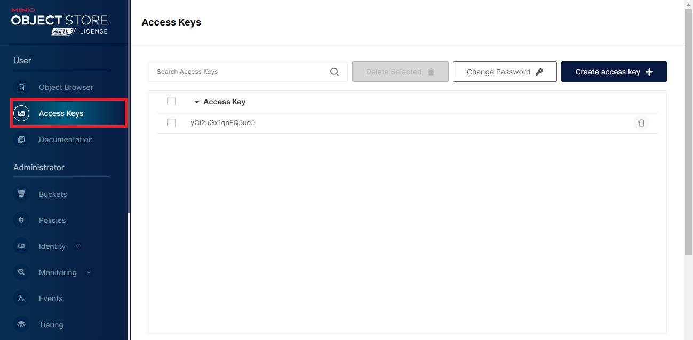
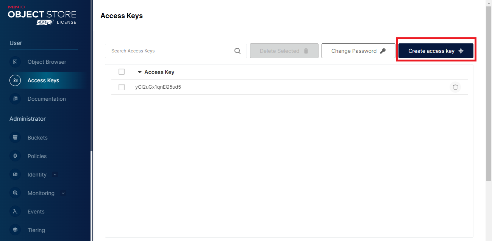
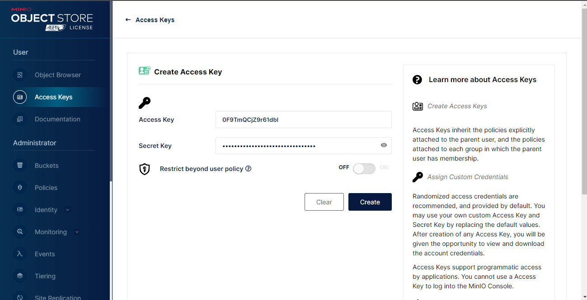

## **Description**

---

The simple project to rent transport, create transport as an admin. Created basic `JWT` auth flow with access and refresh tokens. Used `MongoDB` as data storage and `Minio` for saving images. Client writed on `React` library and used `NextUI` for UI component and `styled-components` for additional styling. Used `Redux` as state manager and `RTK` for working with actions and api service.

## **Prerequisites**

---

- node >= 18.0
- docker

## **Run application**

---

1. Change your credential in the `.env` file. Also you can use default but it`s not secure.

2. Setup your `docker` image by `docker-compose` file, running next command:

   ```properties
   npm run services:start
   ```

3. Open a `http://localhost:9001/` url and login.

4. Create a access key. Open an `Access keys` tab:
   
   Click on `Create key` button:
   
   Create keys and copy it to `.env` file as `MINIO_ACCESS_KEY` and `MINIO_SECRET_KEY`, save this key to file.
   

5. Install your packages for BE part and for FE part open the `src/client` folder:

   ```properties
   npm i
   ```

6. In the root folder run next command for starting application:

   ```properties
   npm run serve
   ```

7. Now you can open `http://localhost:{YOUR_PORT}` to see the result.
